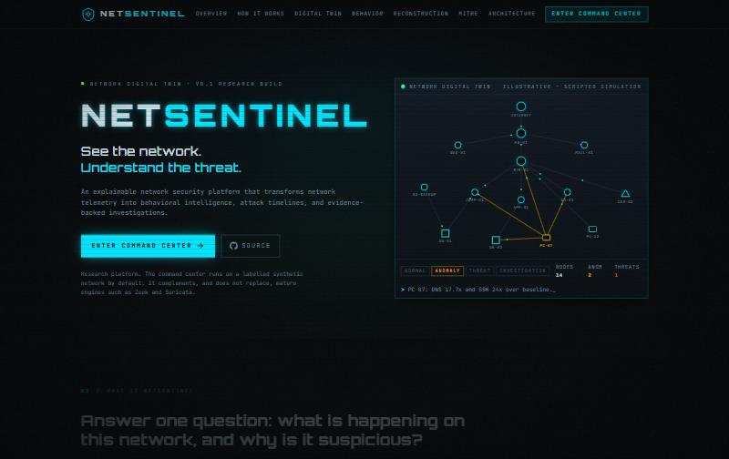
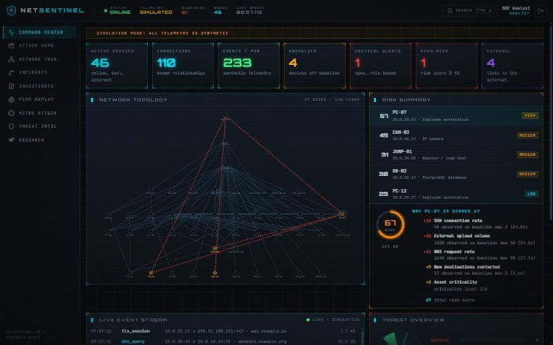
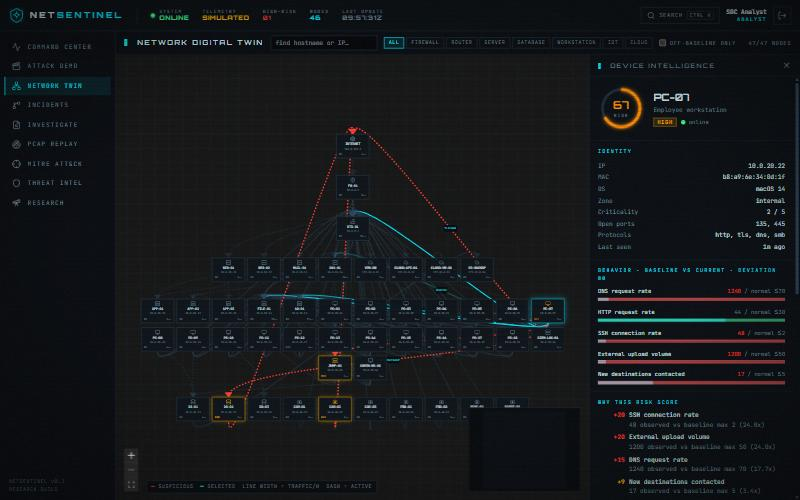
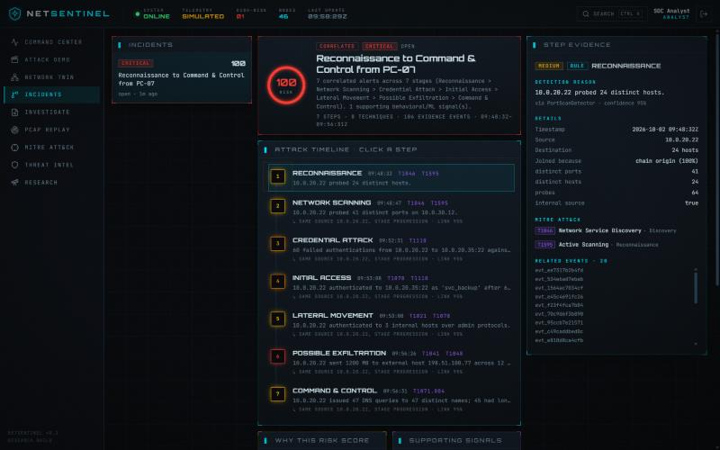
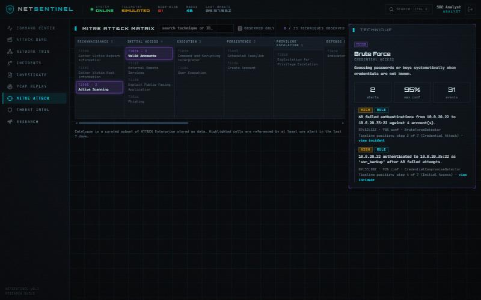
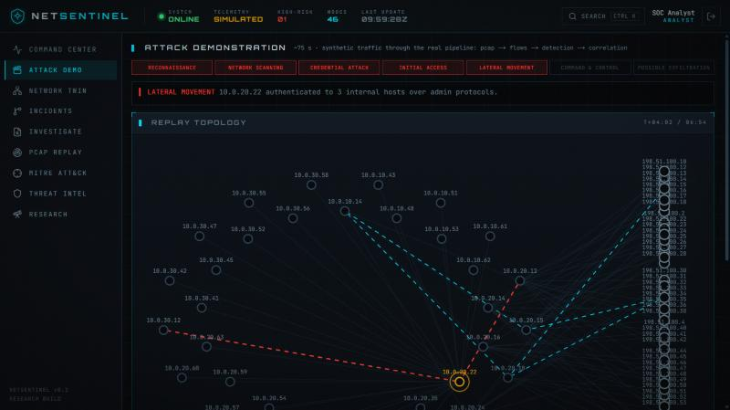
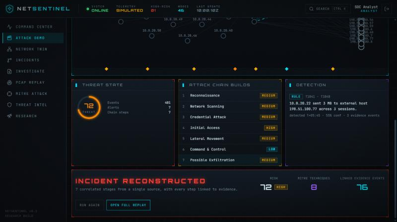
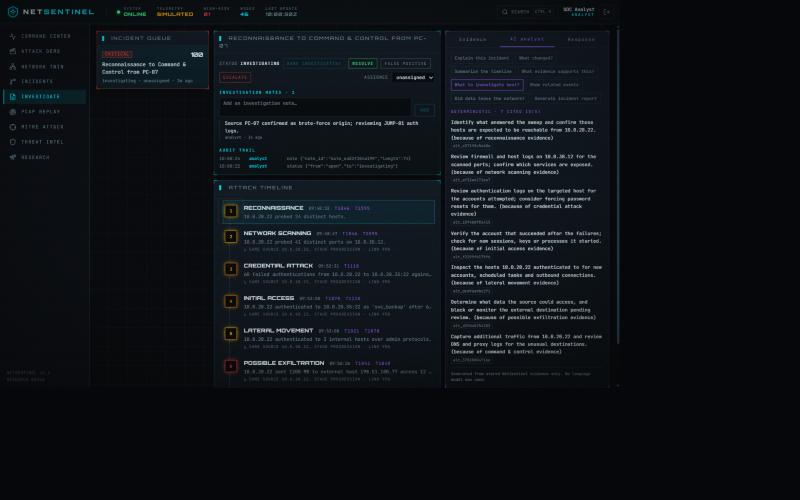
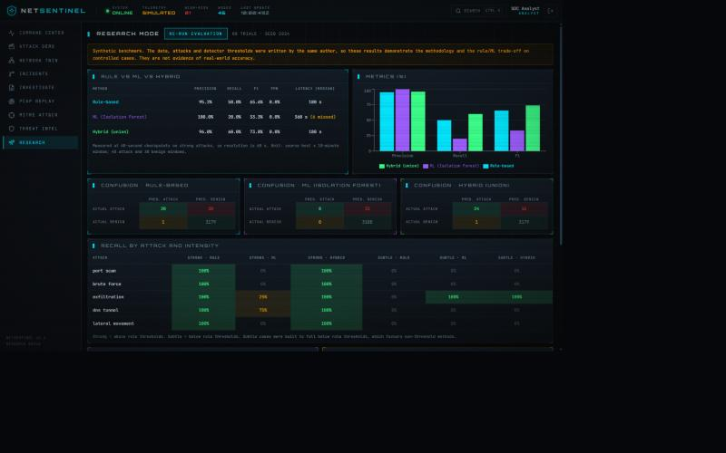

# NetSentinel

**An explainable network digital twin for threat detection, attack reconstruction and security investigation.**

NetSentinel is an MCA research project. It turns network telemetry into per-device behavioral baselines,
transparent risk scores, correlated attack chains mapped to MITRE ATT&CK, and an investigation workspace in which
every conclusion cites the evidence behind it. It is designed to consume telemetry from existing engines (Zeek,
Suricata, PCAP, NetFlow, syslog) rather than replace them, and it does not claim to compete with commercial platforms.

## Problem

Alert-centric tools say *that* something fired, but rarely *why*, what evidence supports it, or how activity evolved.
NetSentinel's question is: **what is happening on this network, why is it suspicious, how did it evolve, what is the evidence,
and what should an analyst check next?** Every score lists its contributing factors, and rule detections, behavioral anomalies, ML anomalies and
correlated incidents are never conflated.

## See it in two minutes

1. Start the stack (below) and sign in.
2. Open **Attack demo** (`/demo`) and press **Start attack simulation**. A synthetic seven-minute intrusion is built as a real PCAP, parsed, detected and
   correlated while the topology reacts and the attack chain assembles. It ends on *Incident reconstructed* with the risk, technique count and linked evidence.
3. Press **Ctrl+K** to jump to any device, incident or MITRE technique; open **Network**, click a device, and read why it is scored the way it is.

## Features

- **Network digital twin:** React Flow topology of 47 simulated devices, traffic-weighted edges, suspicious flows highlighted, per-device intelligence (identity, baseline vs current behavior, risk factors, ML score, connections, events).
- **Transparent behavior scoring:** baseline vs current arithmetic with named factors, no opaque "AI score".
- **Detection engine:** eight pluggable rule detectors plus a credential-compromise detector, an Isolation Forest anomaly detector (always labelled ML), and baseline-deviation alerts. Every alert carries confidence, MITRE techniques and evidence IDs.
- **Correlation and reconstruction:** alerts are linked by entity and time into ordered incidents with an animated, clickable attack chain and an explainable incident risk score.
- **MITRE ATT&CK:** data-driven matrix (33 techniques) with related alerts, confidence and timeline position.
- **Replay and telemetry adapters:** upload a PCAP or a Zeek `conn.log`/`dns.log` (or run the synthetic sample) and replay it with play, pause, step, rewind and a scrubber while detections appear when they first become possible.
- **Investigation workspace:** status, assignment, notes and an audit trail, plus an evidence-bound analyst whose answers cite only stored IDs and say "Insufficient evidence." when the evidence is thin. No language model is used.
- **Threat intelligence and response:** a local indicator store behind a provider interface, and evidence-based response recommendations with a **simulation-only** executor.
- **Research mode:** rule vs ML vs hybrid on a labelled synthetic benchmark (precision, recall, F1, FPR, confusion matrix, latency), clearly labelled as synthetic.

All telemetry is **synthetic** unless a real source is attached, and the UI says so wherever it is shown.

## Architecture

```
telemetry source ─▶ normalized events ─▶ detectors (rule / behavioral / ML) ─▶ alerts + evidence
 (simulator, PCAP;                                                                    │
  Zeek/Suricata/NetFlow later)        risk engine ◀─ attack chain ◀─ correlation ◀────┘
                                          │
                       investigation ◀────┴────▶ analyst (evidence-bound) ─▶ response (simulated)
```

FastAPI + SQLAlchemy backend (SQLite for development, PostgreSQL for deployment), Next.js console, WebSocket for live events and alerts.
See [docs/ARCHITECTURE.md](docs/ARCHITECTURE.md).

## Screenshots

| | |
|---|---|
|  |  |
| Landing page with the animated topology | Command center: metrics, topology, risk breakdown |
|  |  |
| Network digital twin and device intelligence | Reconstructed attack chain with MITRE IDs |
|  |  |
| MITRE ATT&CK matrix and technique detail | Guided demo mid-attack (lateral movement) |
|  |  |
| Demo finale: incident reconstructed | Investigation workspace with the evidence-bound analyst |
|  | |
| Research mode: rule vs ML vs hybrid (synthetic benchmark) | |

## Quick start (local)

Requirements: Python 3.11+, Node 22+.

```bash
cp .env.example .env     # set JWT_SECRET and the SEED_*_PASSWORD values (see comments in the file)

# API  (http://127.0.0.1:8000, OpenAPI docs at /docs)
cd apps/api
python -m venv .venv && .venv/Scripts/pip install -r requirements.txt   # Linux/macOS: .venv/bin/pip
.venv/Scripts/python -m uvicorn app.main:app --port 8000

# Web  (http://localhost:3000)
cd apps/web
npm install
npm run dev
```

Sign in with `admin`, `analyst` or `viewer` and the password you set in `.env`. Migrations run automatically at startup.
On Windows, prefer `127.0.0.1` over `localhost` when calling the API directly from scripts (IPv6 fallback adds ~200 ms per connection).
Docker, public (HTTPS, read-only) deployment and production notes: [docs/DEPLOYMENT.md](docs/DEPLOYMENT.md).

## API

Versioned under `/api/v1`: `auth`, `devices`, `network`, `events`, `alerts`, `detections`, `incidents`, `investigations`, `analyst`, `mitre`, `replay`, `threat-intel`, `response`, `research`, `analytics` (+ `ws/stream`).
Interactive OpenAPI documentation is served at `/docs`. Roles: `VIEWER` (read), `ANALYST` (investigate, simulate, upload), `ADMIN` (everything, including deletes and detector toggles).

## Methodology

- **Risk scoring:** per metric, `points = min(cap, round(5·log2(current / baseline_max)))` when the ratio exceeds 1.5×, plus a criticality amplifier only if something already deviates. PC-07 in the simulation scores **67** (SSH +20, upload +20, DNS +15, new destinations +9, criticality +3); the same breakdown is shown in the UI and pinned by a test.
- **Detection:** [docs/THREAT-DETECTION.md](docs/THREAT-DETECTION.md). **ML:** [docs/ML-METHODOLOGY.md](docs/ML-METHODOLOGY.md). **MITRE:** [docs/MITRE.md](docs/MITRE.md).
- **Replay, analyst, intel and response:** [docs/REPLAY.md](docs/REPLAY.md), [docs/ANALYST.md](docs/ANALYST.md), [docs/INTEL-AND-RESPONSE.md](docs/INTEL-AND-RESPONSE.md).
- **Evaluation and datasets:** [docs/DATASETS.md](docs/DATASETS.md).

## Testing

```bash
cd apps/api && python -m pytest && python -m ruff check .          # 111 tests
cd apps/web && npm test && npm run typecheck && npm run lint && npm run build
```

## Tech stack

Next.js 16, TypeScript, Tailwind v4, Framer Motion, React Flow, Recharts, FastAPI, Pydantic, SQLAlchemy 2, Alembic, PostgreSQL / SQLite,
Scapy, pandas, scikit-learn, pytest, Vitest.

## Limitations

- Telemetry is synthetic by default. Zeek logs and PCAPs can be ingested in batch, but there is no live-streaming Zeek, Suricata or NetFlow adapter yet (the `TelemetrySource` and detector interfaces are the extension points).
- The built-in evaluation uses synthetic data written by the same author as the detectors, so it demonstrates methodology, not real-world accuracy. A CICIDS/UNSW-style CSV evaluator exists (`python -m app.research.csvflows`) but has only been tested on small hand-built files, not the real datasets.
- PCAP analysis is flow-level and IPv4-only; authentication outcomes on encrypted protocols are inferred from flow shape and labelled as inferred.
- The ML model trains on a homogeneous simulated baseline; the analyst is deterministic by design; response actions are simulated only.
- In-process event bus, rate limiting and login throttle (single worker); session token held in `sessionStorage`; not independently audited.
- Docker was validated once by hand (images, PostgreSQL migrations, end-to-end use) but there is no CI. Details in [docs/SECURITY.md](docs/SECURITY.md).
- ML scoring is withheld for ~7.5 minutes after startup while its 10-minute window fills.

## Future work

Streaming telemetry adapters (live Zeek tailing, Suricata, NetFlow, syslog), running the evaluator on the real public datasets, per-role ML baselines, httpOnly-cookie sessions with CSP nonces,
a Redis-backed event bus for multiple workers, cloud flow-log and endpoint telemetry adapters, and approval-gated real response integrations.

## Documentation

[Architecture](docs/ARCHITECTURE.md) · [Security](docs/SECURITY.md) · [Deployment](docs/DEPLOYMENT.md) · [Threat detection](docs/THREAT-DETECTION.md) · [ML methodology](docs/ML-METHODOLOGY.md) · [MITRE](docs/MITRE.md) · [PCAP replay](docs/REPLAY.md) · [Analyst](docs/ANALYST.md) · [Intel and response](docs/INTEL-AND-RESPONSE.md) · [Datasets and evaluation](docs/DATASETS.md) · [Contributing](CONTRIBUTING.md)

## Author

Kaushik. MCA project.
